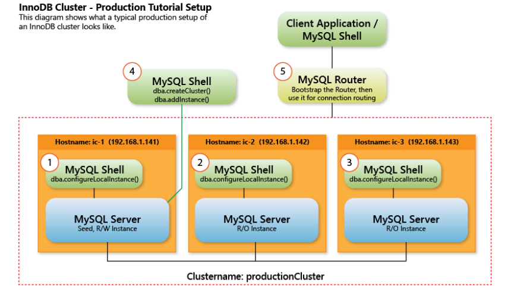

ok ok ok
MySQL InnoDB Cluster - Real-World Cluster Tutorial for RHEL and CentOS

Mô hình cluster như hình bên dưới:



 Hình 1: ví dụ về mô hình InnoDB Cluster

Prerequisites  
Python 
Pyhton is required to use MySQL Shell, please open a terminal and install it.  
Install python on CentOS 7 or Redhat 7

```
$ sudo yum install python
```
Hostname mapping

Important: For this tutorial, we assume that the hostname mapping is already done. That is, the name of each host should be resolvable from the other hosts in the cluster. if not, then please consider configuring the /etc/hosts file before continuing. Hostname mapping is required in order to map a valid hostname to an IP.

CentOS default hostname looks like the follwing:

```
127.0.0.1 localhost localhost.localdomain localhost4 localhost4.localdomain4
::1 localhost localhost.localdomain localhost6 localhost6.localdomain6
```

To configure the host mapping open the hosts file:

```
10.0.152.191 dev-mysql-innodb-cl01
10.0.152.192 dev-mysql-innodb-cl02
10.0.152.193 dev-mysql-innodb-cl03
```

Install the MySQL repository. Create mirror.repo file place in /etc/yum.repos.d with content as below:

```
[mysql57-community]
name=MySQL 5.7 Community Server
baseurl=https://mirror.pvcb.vn/repository/yum-mysql-proxy/mysql-5.7-community/el/7/$basearch/
enabled=1
gpgcheck=0

[mysql-connectors-community]
name=MySQL Connectors Community
baseurl=https://mirror.pvcb.vn/repository/yum-mysql-proxy/mysql-connectors-community/el/7/$basearch/
enabled=1
gpgcheck=0

[mysql-tools-community]
name=MySQL Tools Community
baseurl=https://mirror.pvcb.vn/repository/yum-mysql-proxy/mysql-tools-community/el/7/$basearch/
enabled=1
gpgcheck=0
```
Install MySQl Server and MySQL Shell.

Type the following command in the terminal to install MySQL Server:

On CentOS 7 / Redhat 7 on all 3 nodes:
```
$ sudo yum install mysql-community-server 
```
After the installation of MySQL Server and MySQL Shell finish, start the MySQL Service and Enable it to start on the startup:

The remaining instructions are common for CentOS 7, Redhat 7:
```
$ sudo systemctl start mysqld.service
$ sudo systemctl enable mysqld.service
```
Install MySQL shell to create and manage the MySQL InnoDB Cluster, install on all 3 nodes:
```
yum install -y mysql-shell
```
Affter install MySQL Server and Mysql-shell successfuly, the result as below:
```
[root@dev-mysql-innodb-cl01 yum.repos.d]# rpm -qa | grep mysql
mysql-community-devel-5.7.33-1.el7.x86_64
mysql-community-test-5.7.33-1.el7.x86_64
mysql-community-common-5.7.33-1.el7.x86_64
mysql-community-client-5.7.33-1.el7.x86_64
mysql-community-embedded-5.7.33-1.el7.x86_64
mysql-community-embedded-devel-5.7.33-1.el7.x86_64
mysql-community-embedded-compat-5.7.33-1.el7.x86_64
mysql-shell-8.0.32-1.el7.x86_64
mysql-community-libs-5.7.33-1.el7.x86_64
mysql-community-server-5.7.33-1.el7.x86_64
mysql-community-libs-compat-5.7.33-1.el7.x86_64
mysql-router-community-8.0.32-1.el7.x86_64
```
Note: Version MySQL Server is 5.7, Mysql-shell is 8.0

Before config the Cluster, we'll disable firewalld, and selinux.

Set MySQL root password.

The initializing process of MySQL sets a temporary password for the root account, Which should be changed with MySQL connsole. The password is logged in the MySQL login file - /var/log/mysqld.log. Search for it with:
```
[root@dev-mysql-innodb-cl01 ~]# grep -i "temporary password" /var/log/mysqld.log
2023-02-02T02:52:03.825499Z 1 [Note] A temporary password is generated for root@localhost: Yueky-Cp*8-*
```
And then change the password with mysql_secure_installation

```
[root@dev-mysql-innodb-cl01 ~]# mysql_secure_installation 

Securing the MySQL server deployment.

Enter password for user root:
```

Check the configuratino for MySQL 5.7 InnoDB Cluster and create a cluster administrative account.

```
The MySQL Shell command "mysqlsh" is used to configure and manage the MySQL 5.7 InnoDB Cluster using javaScript syntax. The user accesses MySQL innoDB Cluster functanality with the "dba" object through "mysqlsh"
```

First thing to do before creating the MySQL 5.7 InnoDB Cluster is to check whether the current MySQL configuration is ready and compliant for the Cluster setup. Enther the MySQL Shell and execute the following command:

```sh
[root@db-cluster-1 ~]# mysqlsh
MySQL Shell 8.0.28
 
Copyright (c) 2016, 2022, Oracle and/or its affiliates.
Oracle is a registered trademark of Oracle Corporation and/or its affiliates.
Other names may be trademarks of their respective owners.
 
Type '\help' or '\?' for help; '\quit' to exit.
 MySQL  JS > dba.checkInstanceConfiguration("root@localhost")
Please provide the password for 'root@localhost': ********************
Save password for 'root@localhost'? [Y]es/[N]o/Ne[v]er (default No): No
Validating local MySQL instance listening at port 3306 for use in an InnoDB cluster...
 
ERROR: New account(s) with proper source address specification to allow remote connection from all instances must be created to manage the cluster.
Dba.checkInstanceConfiguration: User 'root' can only connect from 'localhost'. (RuntimeError)
```

----------

```sh
 MySQL  JS >dba.checkInstanceConfiguration("root@localhost")
Please provide the password for 'root@localhost': ********
Save password for 'root@localhost'? [Y]es/[N]o/Ne[v]er (default No): 
Validating local MySQL instance listening at port 3306 for use in an InnoDB cluster...

This instance reports its own address as dev-mysql-innodb-cl02:3306
Clients and other cluster members will communicate with it through this address by default. If this is not correct, the report_host MySQL system variable should be changed.

Checking whether existing tables comply with Group Replication requirements...
ERROR: The following tables do not have a Primary Key or equivalent column: 
campaign.CampaignChannelDetails, campaign.Campaign_channelType, campaign.Campaign_eventTrigger, campaign.Campaign_profile, dbxdb.customergroup, ms_consent.ConsentType_description

Group Replication requires tables to use InnoDB and have a PRIMARY KEY or PRIMARY KEY Equivalent (non-null unique key). Tables that do not follow these requirements will be readable but not updateable when used with Group Replication. If your applications make updates (INSERT, UPDATE or DELETE) to these tables, ensure they use the InnoDB storage engine and have a PRIMARY KEY or PRIMARY KEY Equivalent.
If you can't change the tables structure to include an extra visible key to be used as PRIMARY KEY, you can make use of the INVISIBLE COLUMN feature available since 8.0.23: https://dev.mysql.com/doc/refman/8.0/en/invisible-columns.html

Checking instance configuration...

{
    "status": "error"
}
 MySQL  JS >
```

## dsfsfs

---
title: Change the chunk style
output: html_document
---


```{r class.source="bg-danger", class.output="bg-warning"}
mtcars[1:5, "mpg"]
```

```{r df-drop-ok, class.source="bg-success"}
mtcars[1:5, "mpg", drop = FALSE]
```

```{css, echo=FALSE}
.watch-out {
  background-color: lightpink;
  border: 3px solid red;
  font-weight: bold;
}
```

```{r class.source="watch-out"}
mtcars[1:5, "mpg"]
```

